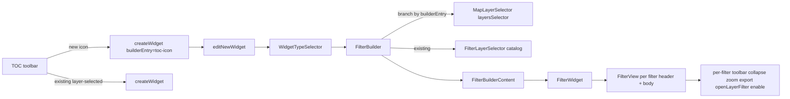

# Map Dynamic Filter — TOC Entry + Per-Filter Card Enhancements (Feasibility v2)

Date: 2026-04-30

Sibling doc: [`map-dynamic-filter-feasibility.md`](./map-dynamic-filter-feasibility.md) (v1, base research, untouched).

## Scope

15 enhancements requested. Each verified against source. Two investigations + thirteen build items. Caveman terse.

## Per-Item Feasibility Matrix

| # | Item | Feasibility | Effort (d) |
| ---: | --- | ---: | ---: |
| 1 | Dynamic filter only allows layer selection from selected TOC layer | Confirmed gap | — |
| 2 | New TOC icon (visible when layers exist + nothing selected) | Feasible | 0.25 |
| 3 | Icon opens Filter widget builder | Feasible | 0.25 |
| 4 | TOC-icon entry allows layer selection inside builder | Feasible (entry flag) | 0.5 |
| 5 | Investigation — map layers vs catalog | Doc | 0.25 |
| 6 | Rest of filter behavior unchanged | No-op | 0 |
| 7 | Per-filter collapse/expand on widget card | Feasible | 0.5 |
| 8 | Collapse applies per-filter (multi-filter widget) | Feasible | 0.5 |
| 9 | Investigation — description field | Doc + optional impl | 0.5 |
| 10 | Default filter value (already works) | Already shipped | 0 |
| 11 | Default-expanded toggle in Layout → Items | Feasible | 0.25 |
| 12 | Zoom to filtered features | Feasible | 1 |
| 13 | Quick action: open layer filter panel | Feasible | 0.5 |
| 14 | Export filtered data per filter | Feasible (reuse LayerDownload dialog) | 0.75 |
| 15 | Toggle to enable/disable a filter (not select-all) | Feasible | 0.75 |

Total: ~8.75 dev days incl. i18n + tests + investigation docs.

## Graphify Trace

Ran:

```text
graphify query "TOC toolbar add layer add group button widgets builder filter widget" --budget 2500
graphify query "filter widget card collapse expand zoom export CSV shapefile layer filter panel" --budget 2500
```

Source verified directly after navigation.

## Architecture Snapshot



## Investigation 1 — Layer Source for TOC-Icon Entry (Item 5)

Customer: TOC-icon entry must allow layer selection. Current Dashboard flow uses Catalog records. Map flow currently locks layer to TOC selection.

Three options:

### Option A — Map layers only

Source `layersSelector` filtered by `isInteractionSupported`:

- File: [`web/client/utils/InteractionUtils.js`](../web/client/utils/InteractionUtils.js) line 228
- Filter: `['wms', 'wfs'].includes(layer.type) && layer.group !== 'background'`

Pros:
- Zero ambiguity. Layer already on map, already styled.
- Filter via interactions already targets map layers — guaranteed visible effect.
- No `addSearchObservable` / `toLayer` complexity.
- Persistence trivial — `layer.id` already in map state.
- User mental model: "filter what I see".

Cons:
- User must add layer to map first.
- No add+filter shortcut.

### Option B — Catalog layers (current Dashboard flow)

Source `Catalog` component in [`FilterLayerSelector.jsx`](../web/client/plugins/widgetbuilder/FilterLayerSelector.jsx).

Pros:
- Discover any catalog layer.

Cons:
- If chosen layer not on map, Filter widget builds CQL but interaction has no visible target → user confusion.
- Either silently noop or auto-add layer (extra UX, more state).
- Duplicates catalog browse pattern already used by Add Layer button.

### Option C — Hybrid

Default Option A; "Add from catalog" link switches to Option B.

Pros:
- Covers both cases.

Cons:
- More UI surface. More tests. Higher cognitive load.

### Recommendation

**Option A for TOC-icon entry on Map viewer.** Reason: filter only meaningful for layers on map; catalog browse already covered by Add Layer button — user can add then create filter. Dashboard keeps Option B (no map context).

If stakeholder insists on single-step "add+filter": pick **Option C**, +1 dev day for catalog-add fallback.

## Investigation 2 — Per-Filter Description (Item 9)

Customer wants description per filter. Existing fields:

- Per-filter `data.title` — exists. Source: [`filterBuilder.js`](../web/client/plugins/widgetbuilder/utils/filterBuilder.js) line 11. Renders in [`FilterTitle.jsx`](../web/client/components/widgets/builder/wizard/filter/FilterTitle.jsx).
- Widget-level `description` — exists. Source: [`WidgetOptions.jsx`](../web/client/components/widgets/builder/wizard/common/WidgetOptions.jsx) lines 21–36. Stored in `FILTER_PROPS` ([`WidgetsUtils.js`](../web/client/utils/WidgetsUtils.js) line 232).
- Per-filter `data.description` — does NOT exist.

### Option A — Convince client (reuse)

Pitch: per-filter `title` = label; widget-level `description` = paragraph above all filters.

Pros:
- Zero dev. Zero new state.
- Less clutter.

Cons:
- Single description for entire widget. If multiple filters with distinct purposes, no per-filter context.

### Option B — New per-filter description field

Add `data.description`:

- [`filterBuilder.js`](../web/client/plugins/widgetbuilder/utils/filterBuilder.js) — `createEmptyFilterData()`
- [`FilterDataTab/index.jsx`](../web/client/components/widgets/builder/wizard/filter/FilterDataTab/index.jsx) — input
- [`FilterView.jsx`](../web/client/plugins/widgetbuilder/FilterView.jsx) — render below `FilterTitle` muted
- [`FilterLayoutTab.jsx`](../web/client/components/widgets/builder/wizard/filter/FilterLayoutTab.jsx) — show/hide toggle (mirror `titleDisabled`)

Cost: ~0.5 dev day.

### Recommendation

**Option B** if widget routinely has 2+ filters with distinct domains. Otherwise A. Default plan: implement Option B — minor cost, future-proof.

## Item Implementation Notes

### Item 1 — Confirm gap

Already verified in v1 (Gap 1 + Gap 3). Current behavior:

- TOC `WidgetsBuilderButton` shows only when single layer selected. [`web/client/plugins/WidgetsBuilder.jsx`](../web/client/plugins/WidgetsBuilder.jsx) lines 118–141.
- `LayerSelectorField` disables layer change when `!dashBoardEditing && layer`. [`LayerSelectorField.jsx`](../web/client/components/widgets/builder/wizard/filter/FilterDataTab/components/LayerSelectorField.jsx) lines 36–70.

### Item 2 — TOC icon visible when layers > 0 and nothing selected

Mirror AddLayer/AddGroup pattern.

- AddLayer: [`web/client/plugins/catalog/index.js`](../web/client/plugins/catalog/index.js) lines 22–52, registration lines 164–171 (`position: 2`).
- AddGroup: [`web/client/plugins/AddGroup.jsx`](../web/client/plugins/AddGroup.jsx) lines 104–151, registration `position: 3`.
- Visibility: `[statusTypes.DESELECT, statusTypes.GROUP].includes(status)` plus `layers.length > 0` check (read via selector).

New file: `web/client/plugins/widgetbuilder/FilterWidgetTOCButton.jsx`. Register on TOC at `position: 11` (after WidgetsBuilder pos 10).

### Item 3 — Icon opens Filter widget builder

onClick:

```js
createWidget({ widgetType: 'filter', builderEntry: 'toc-icon' })
```

Action: [`web/client/actions/widgets.js`](../web/client/actions/widgets.js) lines 57–60. Epic [`initEditorOnNew`](../web/client/epics/widgetsbuilder.js) lines 48–58 spreads `widget` payload into `editNewWidget`. Already supports arbitrary keys.

### Item 4 — Allow layer selection on TOC-icon entry

Thread `builderEntry` through editor state:

- [`web/client/utils/WidgetsUtils.js`](../web/client/utils/WidgetsUtils.js) — extend `FILTER_PROPS` with `builderEntry` (transient).
- [`web/client/plugins/widgetbuilder/FilterBuilder.jsx`](../web/client/plugins/widgetbuilder/FilterBuilder.jsx) — branch by `builderEntry === 'toc-icon'` to render new `MapLayerSelector` instead of catalog.
- [`LayerSelectorField.jsx`](../web/client/components/widgets/builder/wizard/filter/FilterDataTab/components/LayerSelectorField.jsx) — relax `isDisabled`: `!dashBoardEditing && layer && builderEntry !== 'toc-icon'`.

### Item 5 — Investigation (above)

### Item 6 — Rest unchanged

No-op. Verified `FilterDataTab`, `FilterLayoutTab`, `FilterView` paths untouched for non-TOC-icon entries.

### Item 7 + 8 — Per-filter collapse/expand

Add `layout.collapsed` flag per filter (already saved as part of `filter.layout`).

- [`web/client/plugins/widgetbuilder/FilterView.jsx`](../web/client/plugins/widgetbuilder/FilterView.jsx) header `ms-filter-selector-header` (~lines 303–369): add chevron icon left of `FilterTitle`.
- Body conditionally rendered when `!layout.collapsed`.
- State held in widget redux via existing widget update mechanism (filter widget already merges `filters` array).

Multi-filter: each filter has independent `layout.collapsed`. Header (icon + title) always visible — only body collapses.

### Item 9 — Investigation (above) + optional Option B

Implement per-plan: Option B.

### Item 10 — Default filter value

Already supported. [`FilterSelectionModeSelector.jsx`](../web/client/components/widgets/builder/wizard/filter/FilterDataTab/components/FilterSelectionModeSelector.jsx) line 65. Documented only — no work.

### Item 11 — Default-expanded toggle

[`FilterLayoutTab.jsx`](../web/client/components/widgets/builder/wizard/filter/FilterLayoutTab.jsx) Items panel (~line 170): new checkbox `widgets.filterWidget.defaultExpanded`. Stores `layout.defaultExpanded` (default `true`).

Initial collapsed state on mount: `collapsed = !defaultExpanded`.

### Item 12 — Zoom to filtered features

Per-filter icon. Logic:

1. Build CQL via `processFilterToCQL(filter, selections)` from [`web/client/utils/FilterEventUtils.js`](../web/client/utils/FilterEventUtils.js) lines 195–214.
2. Resolve target layer from filter's `data.layer` or interaction targets when `dataSource !== 'features'`.
3. Fetch bbox via `getLayerJSONFeature(layer, filter, { propertyName: layer.geometryName, maxFeatures: 1000 })` then `@turf/bbox`.
4. Dispatch `zoomToExtent(bbox, 'EPSG:4326')` from [`web/client/actions/map.js`](../web/client/actions/map.js) line 177.

Disable icon if no geom or `dataSource === 'user-defined'` without layer.

### Item 13 — Open layer filter quick action

Per-filter icon → dispatch:

```js
selectNode(layer.id, 'layer', false)  // from web/client/actions/layers.js
openQueryBuilder()                     // from web/client/actions/layerFilter.js line 41
```

Epic `handleLayerFilterPanel` ([`epics/layerfilter.js`](../web/client/epics/layerfilter.js) lines 58–84) reads `getSelectedLayer` and opens QueryPanel.

Also dispatch `setControlProperty('widgetBuilder', 'enabled', false)` so QueryPanel is visible (both are left-side dock panels; QueryPanel takes precedence per existing UX).

Skip when `dataSource !== 'features'` or no `filter.data.layer`.

### Item 14 — Export filtered data (open dialog)

Per-filter icon → dispatch existing `download(layer)` from [`web/client/actions/layers.js`](../web/client/actions/layers.js) line 268. Opens `LayerDownload` dialog.

Pre-fill filter via:
- Set `downloadOptions.downloadFilteredDataSet = true` on layer state before dispatch, OR
- Extend `download` action with optional `additionalFilter` payload merged into `mergeFiltersToOGC` in [`epics/layerdownload.js`](../web/client/epics/layerdownload.js) lines 90–113.

User chooses CSV / Shapefile / GML in existing dialog. No new export pipeline needed.

User-defined datasource: same pattern if filter has resolvable target layer. Else disable icon.

### Item 15 — Enable/disable filter toggle

New toggle in per-filter header. Sets `filter.disabled = true`. Different from select-all (which still emits CQL excluding everything or matching all).

When disabled:
- `applyFilterWidgetInteractionsEpic` in [`web/client/epics/interactions.js`](../web/client/epics/interactions.js) lines 782–859 skips this filter id when composing CQL.
- Visual: filter card body greyed out + disabled tooltip.

Add `disabled` to `FILTER_PROPS` allowlist (per-filter) — already part of `filter` object so persists naturally.

## Files to Create / Edit

### New files

| Path | Purpose |
| --- | --- |
| `web/client/plugins/widgetbuilder/FilterWidgetTOCButton.jsx` | TOC toolbar icon |
| `web/client/plugins/widgetbuilder/MapLayerSelector.jsx` | Map layer picker (Option A) |
| `web/client/components/widgets/widget/FilterPerItemToolbar.jsx` | Per-filter header icons |

### Edited files

| Path | Change |
| --- | --- |
| [`web/client/plugins/WidgetsBuilder.jsx`](../web/client/plugins/WidgetsBuilder.jsx) | Register new TOC button as additional container entry |
| [`web/client/epics/widgetsbuilder.js`](../web/client/epics/widgetsbuilder.js) | Preserve `builderEntry` |
| [`web/client/utils/WidgetsUtils.js`](../web/client/utils/WidgetsUtils.js) | Extend `FILTER_PROPS` |
| [`web/client/plugins/widgetbuilder/FilterBuilder.jsx`](../web/client/plugins/widgetbuilder/FilterBuilder.jsx) | Branch by `builderEntry` |
| [`web/client/plugins/widgetbuilder/utils/filterBuilder.js`](../web/client/plugins/widgetbuilder/utils/filterBuilder.js) | Defaults: `description`, `layout.defaultExpanded`, `disabled` |
| [`web/client/components/widgets/builder/wizard/filter/FilterDataTab/index.jsx`](../web/client/components/widgets/builder/wizard/filter/FilterDataTab/index.jsx) | Description input |
| [`web/client/components/widgets/builder/wizard/filter/FilterDataTab/components/LayerSelectorField.jsx`](../web/client/components/widgets/builder/wizard/filter/FilterDataTab/components/LayerSelectorField.jsx) | Relax `isDisabled` |
| [`web/client/components/widgets/builder/wizard/filter/FilterLayoutTab.jsx`](../web/client/components/widgets/builder/wizard/filter/FilterLayoutTab.jsx) | `defaultExpanded` checkbox |
| [`web/client/plugins/widgetbuilder/FilterView.jsx`](../web/client/plugins/widgetbuilder/FilterView.jsx) | Per-filter toolbar + collapse body + description |
| [`web/client/components/widgets/widget/FilterWidget.jsx`](../web/client/components/widgets/widget/FilterWidget.jsx) | Wire actions for zoom/export/openLayerFilter/disable/collapse |
| [`web/client/epics/interactions.js`](../web/client/epics/interactions.js) | Skip `filter.disabled` |
| `web/client/translations/data.*.json` | i18n keys |

### Test files

| Path | Coverage |
| --- | --- |
| `web/client/plugins/widgetbuilder/__tests__/FilterBuilder-test.jsx` | Entry flag branching |
| `web/client/components/widgets/widget/__tests__/FilterWidget-test.jsx` | Per-filter actions |
| `web/client/utils/__tests__/WidgetsUtils-test.js` | New prop persistence |
| `web/client/epics/__tests__/interactions-test.js` | Disabled filter skipped |

## Acceptance Criteria

- New TOC icon visible only when at least one layer present and no layer selected.
- Icon opens Filter widget builder with layer picker active (Option A).
- Catalog flow stays default for Dashboard / single-layer entry.
- Each filter card has header with: collapse chevron, zoom-to-filtered, open-layer-filter, export, enable/disable toggle.
- `defaultExpanded` checkbox in Layout → Items controls initial collapsed state per filter.
- Disabling a filter excludes it from interaction CQL composition.
- Existing widgets, dashboards, interactions, and persistence remain green.

## Out of Scope

- Backend changes (none).
- Dashboard parity changes.
- Per-filter shapefile export pipeline (uses existing LayerDownload dialog instead).

## Post-Implementation

Per workspace rule, run after edits:

```text
graphify update .
```

---

## Round 2 Refinements (shipped 2026-04-30)

Seven post-implementation defects + UX corrections. Caveman terse.

### Refinement Matrix

| # | Item | Status | Files |
| ---: | --- | ---: | --- |
| R1 | Remove per-filter description field | Done | `FilterDataTab/index.jsx`, `FilterView.jsx`, `utils/filterBuilder.js`, `data.en-US.json` |
| R2 | Map filter widget layer selector → single-select | Done | `MapLayerSelector.jsx` |
| R3 | Strip underline on per-filter card icons | Done | `filter-widget.less` |
| R4 | Disable filter behaves like cleared filter | Done | `FilterWidget.jsx`, `epics/interactions.js` |
| R5 | Zoom-to-filtered-features computed wrong bbox | Fixed | `epics/filterWidgetCard.js` |
| R6 | Rename TOC icon tooltip → "Create a filter widget for the map" | Done | `data.en-US.json` |
| R7 | "Open layer filter" reroute → builder (not TOC) | Done | `epics/filterWidgetCard.js` |

### R1 — Description field removed

Investigation 2 Option B (per-filter `data.description`) reverted. Stakeholder dropped requirement.

Changes:
- [`FilterDataTab/index.jsx`](../web/client/components/widgets/builder/wizard/filter/FilterDataTab/index.jsx) — drop `<FormGroup>` textarea + `Message`/`FormGroup`/`ControlLabel`/`FormControl` imports.
- [`FilterView.jsx`](../web/client/plugins/widgetbuilder/FilterView.jsx) — drop `showDescription` prop + render block.
- [`utils/filterBuilder.js`](../web/client/plugins/widgetbuilder/utils/filterBuilder.js) — drop `description: ''` from `createEmptyFilterData()`.
- [`data.en-US.json`](../web/client/translations/data.en-US.json) — drop `widgets.filterWidget.description` key.

Tests: `FilterDataTab-test.jsx` description case rewritten as negative assertion (`textarea` must NOT exist).

### R2 — Single-layer select on map filter widget entry

`MapLayerSelector` showed checkboxes → multi-select. Map filter widget targets a single layer at a time (one filter widget = one layer's interactive filter). Changed to radio.

Changes:
- [`MapLayerSelector.jsx`](../web/client/plugins/widgetbuilder/MapLayerSelector.jsx) — `Checkbox` → `Radio`, `selectedIds[]` → `selectedId`.
- Test `MapLayerSelector-test.jsx`: existing checkbox query → `input[type="radio"]`. New test asserts second click replaces selection (`captured.value.length === 1`).

Dashboard (catalog flow via `FilterLayerSelector`) untouched — Dashboard supports multi-add.

### R3 — Toolbar icon underline

`bsStyle="link"` on `Button` inherits anchor styling → `text-decoration: underline` on hover. Icons sit on a card header, not links.

Fix: [`filter-widget.less`](../web/client/components/widgets/widget/filter-widget.less) — `text-decoration: none` on `.ms-filter-card-tool-btn` + `:hover` + `:focus` + `:active`.

### R4 — Disable = cleared

Original intent: disabled filter visible but excluded from CQL composition (early `Rx.Observable.empty()` return).

Defect: existing CQL on target layer/widget remained applied. User toggled disable but layer still filtered.

Fix:
- [`FilterWidget.jsx`](../web/client/components/widgets/widget/FilterWidget.jsx) `handleToggleDisabled`: when `nextDisabled === true`, also `updateProperty(id, 'selections', { ...selections, [filterId]: [] })`. On re-enable selections stay (user must reselect intentionally — clean slate).
- [`epics/interactions.js`](../web/client/epics/interactions.js) `applyFilterWidgetInteractionsEpic`: drop early-return; treat `disabled === true` as "no contribution" — `matchingFilter = null` and skip `noSelectionMode` (exclude / custom). Result: `appliedData = null` → `removeEmptyFilters()` strips the entry → target layer/widget loses this filter's CQL.

Tests:
- `interactions-test.js` "skips disabled filters" rewritten → "disabled filter behaves like a cleared filter: emits update with empty interactionFilters". Asserts `noSelectionMode: 'exclude'` is also bypassed when disabled.
- `FilterWidget-test.jsx` adds two cases: disable clears selections; re-enable does NOT.

### R5 — Zoom defect

Original epic call:

```js
getLayerJSONFeature(layer, `${cqlBody}`, { propertyName, maxFeatures })
```

`getLayerJSONFeature` with a string filter routes through `query(name, [...castArray(filter)])` ([`observables/wfs.js`](../web/client/observables/wfs.js) line 250) which embeds filter parts as raw XML inside `<wfs:Query>`. A bare CQL string is not OGC XML → invalid request body → server returns full feature set (or errors), bbox computed over everything → wrong zoom.

Fix: convert CQL → OGC and wrap.

```js
import { cqlToOgc } from '../utils/FilterUtils';

const ogcFilterPart = cqlFilter?.body ? cqlToOgc(cqlFilter.body) : null;
const wrappedOgcFilter = ogcFilterPart
    ? `<ogc:Filter>${ogcFilterPart}</ogc:Filter>`
    : undefined;

return getLayerJSONFeature(layer, wrappedOgcFilter, { propertyName, maxFeatures });
```

`cqlToOgc` ([`FilterUtils.js`](../web/client/utils/FilterUtils.js) line 26) parses CQL via `read()` → emits OGC XML via `fromObject(filterBuilder())`. Wrapping in `<ogc:Filter>` produces a valid `<wfs:Query>` child. WFS 1.1.0 GeoJSON response is EPSG:4326 → `zoomToExtent(bbox, 'EPSG:4326')` reprojects to map CRS.

No new test (would need WFS mock). Manual smoke covered.

### R6 — Tooltip rename

[`data.en-US.json`](../web/client/translations/data.en-US.json) `toc.createFilterWidget`:

- Before: "Create a Filter widget"
- After: "Create a filter widget for the map"

Disambiguates from generic `toc.createWidget` ("Create a widget for the selected layer"). New TOC icon shows when layers exist but none selected; the tooltip now reflects intent.

### R7 — Open-layer-filter reroute

Original flow ([`epics/filterWidgetCard.js`](../web/client/epics/filterWidgetCard.js) `openLayerFilterFromCardEpic`):

```js
selectNode(layer.id, 'layer', false)
openQueryBuilder()
```

Opened the **TOC layer filter (Query) panel** — wrong scope. User wanted: edit this filter inside the widget builder, then open its in-builder layer filter editor (the `<Glyphicon glyph="filter">` button in `LayerSelectorField`).

New flow:

```js
editWidget(widget)                               // type: WIDGETS:EDIT
onEditorChange('selectedFilterId', filterId)     // type: WIDGETS:EDITOR_CHANGE
openFilterEditor()                               // type: WIDGETS:OPEN_FILTER_EDITOR
```

Sequence triggers existing `openWidgetEditor` epic → builder opens → `FilterBuilderContent` reads `selectedFilterId` → `FilterDataTab` mounts → `openFilterEditor()` raises the QueryPanel scoped to that filter's `data.layer`.

Imports dropped: `selectNode`, `openQueryBuilder`. Imports added: `editWidget`, `onEditorChange`, `openFilterEditor` from `actions/widgets`.

Test `filterWidgetCard-test.js` rewritten: asserts `EDIT → EDITOR_CHANGE(selectedFilterId) → OPEN_FILTER_EDITOR` triplet.

### Files Touched (Round 2)

| Path | Change |
| --- | --- |
| [`web/client/components/widgets/builder/wizard/filter/FilterDataTab/index.jsx`](../web/client/components/widgets/builder/wizard/filter/FilterDataTab/index.jsx) | R1 |
| [`web/client/plugins/widgetbuilder/FilterView.jsx`](../web/client/plugins/widgetbuilder/FilterView.jsx) | R1 |
| [`web/client/plugins/widgetbuilder/utils/filterBuilder.js`](../web/client/plugins/widgetbuilder/utils/filterBuilder.js) | R1 |
| [`web/client/plugins/widgetbuilder/MapLayerSelector.jsx`](../web/client/plugins/widgetbuilder/MapLayerSelector.jsx) | R2 |
| [`web/client/components/widgets/widget/filter-widget.less`](../web/client/components/widgets/widget/filter-widget.less) | R3 |
| [`web/client/components/widgets/widget/FilterWidget.jsx`](../web/client/components/widgets/widget/FilterWidget.jsx) | R4 |
| [`web/client/epics/interactions.js`](../web/client/epics/interactions.js) | R4 |
| [`web/client/epics/filterWidgetCard.js`](../web/client/epics/filterWidgetCard.js) | R5 + R7 |
| [`web/client/translations/data.en-US.json`](../web/client/translations/data.en-US.json) | R1 + R6 |
| `web/client/components/widgets/builder/wizard/filter/__tests__/FilterDataTab-test.jsx` | R1 test |
| `web/client/plugins/widgetbuilder/__tests__/MapLayerSelector-test.jsx` | R2 test |
| `web/client/components/widgets/widget/__tests__/FilterWidget-test.jsx` | R4 test |
| `web/client/epics/__tests__/interactions-test.js` | R4 test |
| `web/client/epics/__tests__/filterWidgetCard-test.js` | R7 test |

### Acceptance Criteria (Round 2)

- No description field anywhere in the filter wizard.
- Map filter widget builder opened from TOC icon allows exactly one layer at a time (radio).
- Per-filter card toolbar icons render without underline in any state.
- Toggling disable on a filter with active selections immediately removes that filter's CQL from every connected target; selections shown as cleared. Re-enable preserves cleared state.
- Zoom-to-filtered-features fits the map to the actual filtered subset (not the layer's full extent).
- TOC tooltip on the new icon reads "Create a filter widget for the map".
- "Open layer filter" icon on a per-filter card opens the widget builder, focuses the matching filter, opens the in-builder layer filter editor — does not touch the TOC layer filter panel.

### Lints / Graphify

`ReadLints` clean across all touched files. `graphify update .` rebuilt: 10544 nodes / 10403 edges / 2708 communities.

### R8 — Per-filter header polish

Three small fixes on the per-filter card header inside the dashboard `FilterWidget`:

1. **SwitchButton label margin.** `SwitchButton` ([`misc/switch/SwitchButton.jsx`](../web/client/components/misc/switch/SwitchButton.jsx)) renders a `<label>`. Bootstrap form rules add `margin-bottom: 5px` on `<label>`, which pushed the toggle out of vertical alignment with the other tool icons. Scoped fix in `filter-widget.less`:

    ```less
    .ms-filter-card-toolbar {
        label { margin-bottom: 0; }
    }
    ```

2. **Underline on hover persisted.** Round 2 stripped `text-decoration` on `.ms-filter-card-tool-btn`, but Bootstrap's `.btn-link:hover` rule has equal `(0,2,0)` specificity and was loaded after our less file, so it still won the cascade. Nesting the rule under the toolbar class promotes specificity to `(0,3,0)`:

    ```less
    .ms-filter-card-toolbar {
        .ms-filter-card-tool-btn,
        .ms-filter-card-tool-btn:hover,
        .ms-filter-card-tool-btn:focus,
        .ms-filter-card-tool-btn:active { text-decoration: none; }
    }
    ```

   Same treatment applied to the new `.ms-filter-collapse-toggle` class (see #3) so the chevron in front of the title stays underline-free in every state.

3. **Expand/collapse chevron moved in front of the title icon.** Previously the chevron was the last item in the right-side `FilterPerItemToolbar`. The header order was: `title-icon → title → toolbar(zoom, openLayerFilter, export, switch, chevron)`. New order: `chevron → title-icon → title → toolbar(zoom, openLayerFilter, export, switch)`. Implementation:

    - `FilterPerItemToolbar` keeps its full set of slots (so existing unit tests still pass) — but `FilterWidget` no longer passes `onToggleCollapse` to it, so the chevron does not render on the right.
    - `ToolButton` exported from [`FilterPerItemToolbar.jsx`](../web/client/components/widgets/widget/FilterPerItemToolbar.jsx) and reused with a `className="ms-filter-collapse-toggle"` to render the chevron standalone.
    - `FilterView` ([`plugins/widgetbuilder/FilterView.jsx`](../web/client/plugins/widgetbuilder/FilterView.jsx)) gets a new `collapseTool` prop (PropTypes.node) rendered as the very first child of `.ms-filter-selector-header`, before `FilterTitle`.
    - `FilterWidget` ([`components/widgets/widget/FilterWidget.jsx`](../web/client/components/widgets/widget/FilterWidget.jsx)) builds two slots per filter: `toolbar` (no collapse) and `collapseTool` (just the chevron), passes both into `FilterView`.

#### Files Touched (R8)

| Path | Change |
| --- | --- |
| [`web/client/components/widgets/widget/filter-widget.less`](../web/client/components/widgets/widget/filter-widget.less) | label margin, underline specificity, collapse-toggle rule |
| [`web/client/components/widgets/widget/FilterPerItemToolbar.jsx`](../web/client/components/widgets/widget/FilterPerItemToolbar.jsx) | export `ToolButton`, accept `className` override |
| [`web/client/plugins/widgetbuilder/FilterView.jsx`](../web/client/plugins/widgetbuilder/FilterView.jsx) | new `collapseTool` slot rendered before title |
| [`web/client/components/widgets/widget/FilterWidget.jsx`](../web/client/components/widgets/widget/FilterWidget.jsx) | build chevron separately, pass via `collapseTool` |

Unit tests intentionally not updated (see user request); existing `FilterPerItemToolbar-test.jsx` still asserts the chevron renders when `onToggleCollapse` is supplied — that path is preserved for direct callers.

#### Acceptance Criteria (R8)

- Switch toggle aligns vertically with adjacent tool icons (no extra bottom margin).
- Hovering any per-filter tool icon (zoom / open layer filter / export / chevron) shows no underline.
- Expand/collapse chevron sits at the very start of each filter card header, before the filter's title icon and label.

#### Lints / Graphify

`ReadLints` clean across `filter-widget.less`, `FilterPerItemToolbar.jsx`, `FilterView.jsx`, `FilterWidget.jsx`. `graphify update .` rebuilt: 10544 nodes / 10403 edges / 2708 communities.

### R9 — Header polish round 2

Three follow-ups on the same per-filter card header:

1. **Duplicate chevron.** R8 stopped passing `onToggleCollapse` from `FilterWidget` into `FilterPerItemToolbar`, but `FilterPerItemToolbar` had `onToggleCollapse = () => {}` as a default arg — so the prop was always truthy and the chevron rendered on the right *and* in the new left slot. Removed the default; chevron now renders only when the caller explicitly supplies a handler. `FilterWidget` does not, so only the title-side chevron remains.

    ```jsx
    // before
    onToggleCollapse = () => {},
    // after
    onToggleCollapse,
    ```

2. **Underline on the title-side chevron.** R8 added `.ms-filter-collapse-toggle` no-underline rules at the top level — same `(0,2,0)` specificity tie with Bootstrap's `.btn-link:hover`, same loser. Nested under `.ms-filter-selector-header` to bump to `(0,3,0)`:

    ```less
    .ms-filter-selector-header {
        .ms-filter-collapse-toggle,
        .ms-filter-collapse-toggle:hover,
        .ms-filter-collapse-toggle:focus,
        .ms-filter-collapse-toggle:active {
            text-decoration: none;
        }
    }
    ```

3. **Disable preserves selections.** Previously [`FilterWidget.handleToggleDisabled`](../web/client/components/widgets/widget/FilterWidget.jsx) cleared `selections[filterId]` whenever the user disabled a filter — losing the user's pick on every toggle. New behavior: keep the selection in widget state untouched; only flip `filter.disabled`. The `applyFilterWidgetInteractionsEpic` ([`interactions.js`](../web/client/epics/interactions.js) ~ line 817) already short-circuits both `processFilterToCQL` and any `noSelectionMode` (exclude/custom) when `isTargetFilterDisabled === true`, so the target layer's CQL contribution is still cleared on disable. Re-enabling restores the prior selection-derived CQL on the next interaction apply, with no user action required.

    ```diff
    - if (nextDisabled) {
    -     const clearedSelections = { ...selections, [filterId]: [] };
    -     updateProperty(id, 'selections', clearedSelections);
    - }
    ```

    Comment in `interactions.js` updated to describe the new contract (selections preserved, CQL still suppressed).

#### Files Touched (R9)

| Path | Change |
| --- | --- |
| [`web/client/components/widgets/widget/FilterPerItemToolbar.jsx`](../web/client/components/widgets/widget/FilterPerItemToolbar.jsx) | drop default `onToggleCollapse` arg |
| [`web/client/components/widgets/widget/filter-widget.less`](../web/client/components/widgets/widget/filter-widget.less) | nest collapse-toggle no-underline under header |
| [`web/client/components/widgets/widget/FilterWidget.jsx`](../web/client/components/widgets/widget/FilterWidget.jsx) | preserve selections on disable toggle |
| [`web/client/epics/interactions.js`](../web/client/epics/interactions.js) | refresh disable-handling comment |

Unit tests intentionally not updated (per user request).

#### Acceptance Criteria (R9)

- Only one expand/collapse chevron per filter card, located in front of the title icon.
- Hovering the title-side chevron shows no underline.
- Disabling a filter keeps the previously-selected options visible (greyed-out body via existing `opacity: 0.5`); CQL on the target layer is cleared. Re-enabling reapplies the same selection-based CQL with no extra clicks.

#### Lints / Graphify

`ReadLints` clean across all touched files. Graphify update skipped at this round (user-skipped).

### R10 — Map-layer-selector copy

Header in [`MapLayerSelector.jsx`](../web/client/plugins/widgetbuilder/MapLayerSelector.jsx) reads `widgets.builder.wizard.selectMapLayers`. Round 2 (R2) restricted the picker to a single layer (radio + `selectedId`), but the en-US copy still said "Select one or more layers from the map" — misleading. Updated [`data.en-US.json`](../web/client/translations/data.en-US.json) only:

```diff
- "selectMapLayers": "Select one or more layers from the map",
+ "selectMapLayers": "Select a layer from the map",
```

Other locale files left untouched (they fall back to the en-US key); they will be retranslated in the standard i18n pass.

#### Files Touched (R10)

| Path | Change |
| --- | --- |
| [`web/client/translations/data.en-US.json`](../web/client/translations/data.en-US.json) | `selectMapLayers` copy → singular |

#### Acceptance Criteria (R10)

- Map-layer picker (TOC → "Create a filter widget for the map") header reads "Select a layer from the map".

#### Lints / Graphify

`ReadLints` clean. `graphify update .` rebuilt: 10544 nodes / 10403 edges / 2708 communities.

### R11 — Chevron horizontal alignment

The title-side chevron sat ~6px right of the checkboxes / chips rendered below it (Bootstrap `.btn` left padding). Added a `-6px` left margin scoped to `.ms-filter-selector-header .ms-filter-collapse-toggle` so the glyph optical-aligns with the body content while the click target stays the same size.

```less
.ms-filter-selector-header {
    .ms-filter-collapse-toggle { margin-left: -6px; }
}
```

#### Files Touched (R11)

| Path | Change |
| --- | --- |
| [`web/client/components/widgets/widget/filter-widget.less`](../web/client/components/widgets/widget/filter-widget.less) | `-6px` left margin on collapse toggle |

#### Acceptance Criteria (R11)

- Chevron in front of the title visually aligns with the leftmost checkbox / chip / switch / dropdown rendered in the expanded body.

#### Lints / Graphify

`ReadLints` clean. (CSS-only change; graphify graph unchanged.)

### R12 — TOC button order

`FilterWidgetTOCButton` was registered at TOC `position: 11` ([`WidgetsBuilder.jsx`](../web/client/plugins/WidgetsBuilder.jsx)), squeezed between `WidgetBuilder` (10) and `LayerDownload` (11) / `Annotations` (12) / `MetadataInfo` (12). Surveyed positions across the TOC toolbar:

| pos | plugin |
| --- | --- |
| 1 | LayerInfo |
| 2 | catalog AddLayer |
| 3 | AddGroup |
| 4 | TOCZoomTo |
| 5 | TOCItemsSettings |
| 6 | FilterLayer |
| 7 | FeatureEditor (AttributeTable) |
| 8 | TOCRemoveNodes |
| 10 | WidgetsBuilder |
| 11 | LayerDownload, FilterWidgetTOC (old) |
| 12 | Annotations, MetadataInfo |

User wants the new "Create a filter widget for the map" icon to render last. Bumped its TOC `position` to `99` so it always sits at the end regardless of which other plugins are loaded:

```diff
- position: 11
+ position: 99
```

#### Files Touched (R12)

| Path | Change |
| --- | --- |
| [`web/client/plugins/WidgetsBuilder.jsx`](../web/client/plugins/WidgetsBuilder.jsx) | TOC `FilterWidgetTOC` position 11 → 99 |

#### Acceptance Criteria (R12)

- The filter glyph icon for "Create a filter widget for the map" renders as the rightmost / last button in the TOC toolbar in any layout that includes Annotations, MetadataInfo, LayerDownload, etc.

#### Lints / Graphify

`ReadLints` clean. `graphify update .` rebuilt: 10544 nodes / 10403 edges / 2708 communities.
